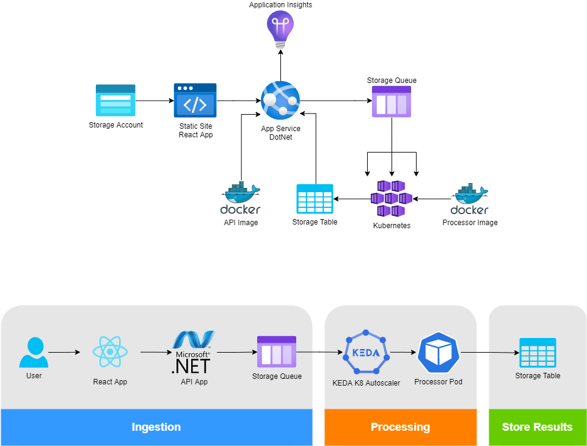

# Halo Wishing Well

This is an (incomplete) sample project for 343 industries.

- [Getting Started](#getting-started)
- [Architecture](#architecture)
- [Devops Pipeline](.github/workflows/README.md)
    - Powershell scripts
        - Expose release-pipeline functionality for developer convenience
        - Keep release-pipeline DRY

## Getting Started

### Lint

```sh
./devops/scripts/lint.ps1
```

## Build

```sh
./devops/scripts/build.ps1
```

## Architecture

This project is intended to be a sample ingestion and processing pipeline. Queue items are ingested via an API with SPA frontend. Queue items are watched via KEDA and processed in a pod inside kubernetes. "Results" get saved to a storage table. The frontend and backend both use AAD JWT token auth.


