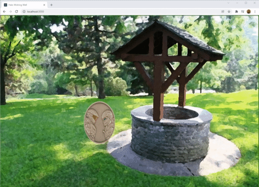

# WishingWell Frontend



This project was bootstrapped with [Create React App](https://github.com/facebook/create-react-app).

## Available Scripts

In the project directory, you can run:

### `npm start`

Runs the app in the development mode. Open [http://localhost:3000](http://localhost:3000) to view it in the browser.

### `npm test`

Launches the test runner in the interactive watch mode.

### `npm run build`

Builds the app for production to the `build` folder.

### Build time environment variables

```text
REACT_APP_AD_APPLICATION_ID - AAD App Registration Application ID
REACT_APP_AD_TENANT_ID - AAD App Registration Tenant ID
REACT_APP_AD_REDIRECT - AAD App Registration Redirect URI
REACT_APP_DONOTUSE_ONLY_FOR_CI_DISABLE_AUTHENTICATION - Disable auth for CI/local testing
```
